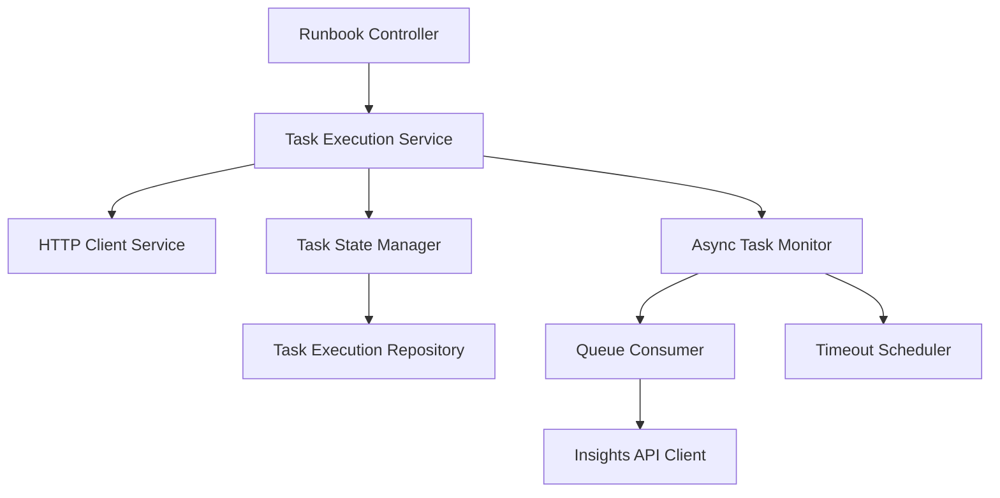
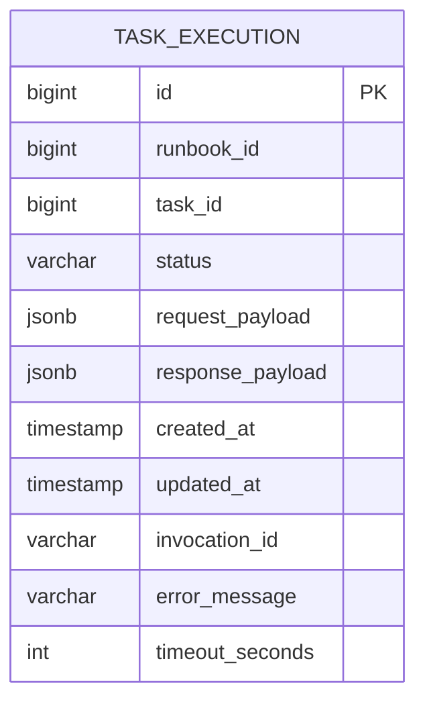
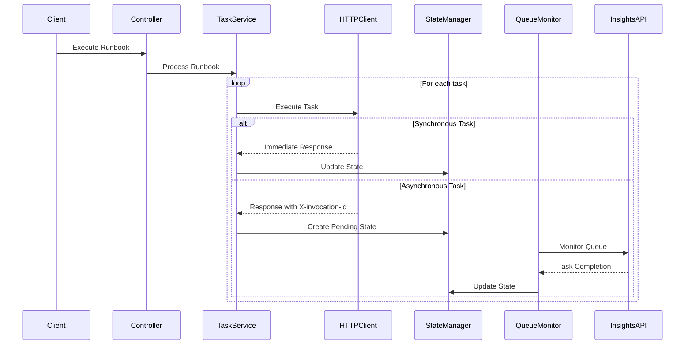

# API Executor Design

## System Overview

The API Executor is designed to execute runbooks and tasks from the auto-executor project, handling both synchronous and asynchronous task execution with proper state management and monitoring.

## Components

### 1. Core Components

### 2. Database Schema

### 3. Message Flow

## Component Details

### 1. Runbook Controller
- REST endpoints for runbook execution
- Input validation and request processing
- Response formatting

### 2. Task Execution Service
- Orchestrates task execution flow
- Manages task dependencies
- Handles both sync and async tasks
- Coordinates with other services

### 3. HTTP Client Service
- Makes HTTP requests to task URLs
- Handles different HTTP methods
- Manages request/response transformation
- Handles headers including X-invocation-id

### 4. Task State Manager
- Manages task execution states
- Updates TASK_EXECUTION table
- Handles state transitions
- Manages error states

### 5. Async Task Monitor
- Monitors INVOCATION_COMPLETED_TASKS queue
- Processes completed task notifications
- Updates task states based on queue messages
- Manages timeout scheduling

### 6. Queue Consumer
- Consumes messages from INVOCATION_COMPLETED_TASKS
- Processes task completion notifications
- Updates task execution records

### 7. Insights API Client
- Communicates with Insights API
- Handles API authentication
- Processes API responses

### 8. Timeout Scheduler
- Manages task timeouts
- Updates task states to TIMED_OUT
- Handles timeout notifications

## State Management

### Task States
1. PENDING
2. IN_PROGRESS
3. COMPLETED
4. FAILED
5. TIMED_OUT

## Error Handling

1. HTTP Request Failures
2. Queue Processing Errors
3. Database Operation Failures
4. Timeout Handling
5. State Transition Errors

## Configuration

1. Queue Configuration
   - Queue names
   - Consumer group
   - Polling intervals

2. Timeout Configuration
   - Default timeout values
   - Retry policies

3. Database Configuration
   - Connection settings
   - Pool settings

4. HTTP Client Configuration
   - Connection timeouts
   - Retry policies
   - Circuit breaker settings

## Monitoring and Metrics

1. Task Execution Metrics
   - Success/failure rates
   - Execution times
   - Timeout rates

2. Queue Metrics
   - Queue size
   - Processing latency
   - Error rates

3. System Health
   - Service uptime
   - Resource utilization
   - Error rates

## Security Considerations

1. API Authentication
2. Queue Access Control
3. Database Security
4. HTTP Client Security
5. Audit Logging

## Additional Considerations

1. Scalability
   - Horizontal scaling of services
   - Queue partitioning
   - Database sharding

2. Performance
   - Connection pooling
   - Caching strategies
   - Batch processing

3. Reliability
   - Circuit breakers
   - Retry mechanisms
   - Error recovery

4. Maintainability
   - Logging strategy
   - Monitoring setup
   - Alerting configuration
